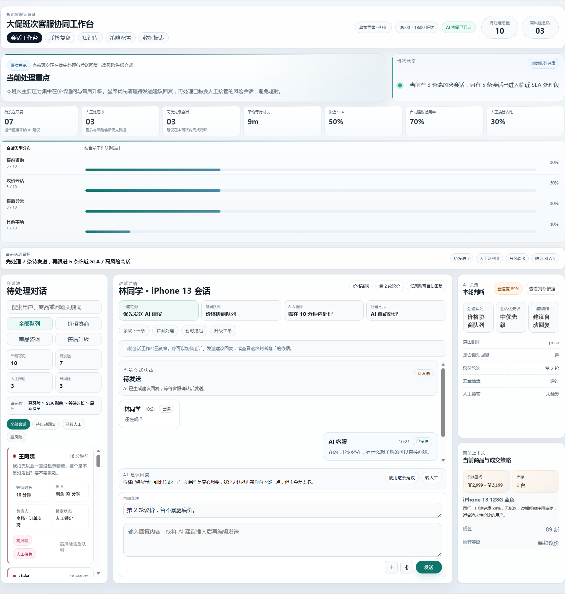

# AI 智能客服协同工作台
[](#项目概述)
[](#核心能力)
[](#项目结构)
[](./LICENSE)

一个面向电商客服场景的 AI 客服协同工作台原型，聚焦多会话处理、风险识别、人工接管与策略发布。

这个项目的重点不是把 AI 做成一个单独的聊天机器人，而是把 AI 放进真实的客服工作流里，去处理队列优先级、意图路由、回复建议、风险识别、人工接管、知识校验和发布控制等问题。

当前开源版本以 `showcase/` 中的 Frontend 演示为核心：它可以独立运行，模拟多栏客服工作台、会话处理流程和运营配置界面。同时，仓库里也保留了早期的 Python 侧探索代码、Prompt 模板、架构文档和 Evaluation 骨架，让整个项目更像一个完整的产品化案例，而不是单一页面。



## ✨ 项目概述

在真实客服场景里，难点通常不是“生成一句回复”，而是：

- 多条会话同时进入队列时，应该先处理哪一条
- 哪些会话适合采用 AI 建议，哪些必须转人工
- 商品咨询、价格协商、售后争议和高风险场景分别需要什么上下文
- 如何在有限时间内，同时看清 `SLA`、风险、优先级和下一步动作

这个项目围绕这些问题，设计了一套更接近生产场景的客服协同工作台，而不是普通的聊天页面。

它的定位不是“做一个会聊天的 Demo”，而是尝试回答一个更贴近业务的问题：当客服团队同时面对咨询、售后、争议、催发货、价格协商和高风险用户时，AI 到底应该在什么环节介入，怎么介入，以及什么时候必须让位给人工。

## 🎯 业务背景

电商客服并不是单线程工作。一个真实班次里，坐席通常会同时面对几十条甚至上百条会话，难点主要集中在以下几个方面：

- **队列压力高**：新会话不断进入，坐席必须快速判断先处理谁，而不是按时间顺序机械回复
- **场景差异大**：商品咨询、议价、物流追问、退换货、投诉争议需要完全不同的处理口径
- **风险会话混杂**：有些会话可以半自动处理，有些一旦误答就可能带来退款、差评、投诉或平台处罚风险
- **上下文分散**：客服在回复前往往需要同时查看商品信息、订单状态、历史聊天、售后规则和内部策略
- **人工资源有限**：真正稀缺的不是“能不能生成一句回复”，而是“能不能让人工把时间花在最值得处理的会话上”

基于这个背景，这个项目把目标定义成一套 AI 客服协同工作台，而不是单纯的聊天组件。它希望把“会话优先级”“风险识别”“人工接管”“知识回流”“策略发布”这些实际工作中的关键环节，一起体现在界面和交互里。

## 🧠 AI 如何体现在业务里

这个项目里对 AI 的理解，不是“页面上放一个智能问答框”，而是把 AI 拆成多个业务能力层：

- **意图识别**：先判断当前会话属于商品咨询、价格协商、售后争议、履约确认还是高风险投诉，再决定应该调取什么上下文和动作入口
- **回复建议**：不是直接替客服自动发送，而是给出可以采纳、编辑、拒绝的建议回复，让 AI 成为坐席的 Copilot
- **风险判断**：根据会话类型、敏感词、`SLA` 状态、情绪升级和知识缺口信号，判断是否继续自动辅助，还是触发转人工或升级
- **上下文路由**：不同场景下，右侧面板展示的内容不同。价格咨询更关注商品卡和库存，售后争议更关注规则、凭证和人工处理建议
- **知识校验**：当 AI 无法稳定命中答案时，不是简单失败，而是把问题沉淀成知识缺口，回流到配置台或知识源治理流程
- **发布与验证**：AI 能力不是改完 Prompt 就结束，还需要有草稿、验证、发布、回滚和影响确认的管理过程

这也是这个项目和普通聊天页最大的区别：它强调的是 AI 如何进入业务流程，而不是 AI 单点输出了什么。

## 🚀 核心能力

- 基于风险、等待时长、会话状态和负责人等信号进行队列调度
- 提供 AI 辅助回复流程，包括意图识别、建议回复、置信线索和判断依据
- 支持售后争议、知识缺口、升级工单、人工接管等风险处理流程
- 根据不同会话类型动态切换右侧决策面板，而不是固定展示一张信息卡
- 提供主管视角的 AI 配置、知识校验、发布准备和影响确认界面
- 通过状态流转模拟真实客服工作台，而不是静态页面拼接

## 🧩 产品模块

当前 `showcase/` 主要包含四个产品模块：

### 1. 工作台首页

- 团队级 `KPI` 总览
- 风险与积压告警
- 高优先级任务和快捷入口

### 2. 对话中心

- 多会话队列与筛选
- 当前会话详情和建议回复
- 人工接管、升级、知识缺口回流等动作

### 3. AI 配置台

- 知识源检查
- 策略变更验证
- 草稿、校验、发布的闭环流程

### 4. 系统设置

- 模型路由与兜底策略
- 渠道接入假设
- 权限、审计与发布控制

## 🛠️ 技术栈

这个项目虽然当前公开版本以 Frontend 为主，但技术栈并没有被简化成“只有 HTML + CSS + JavaScript”。相反，我希望它在仓库展示层面也能体现出比较完整的产品化思路。

### Frontend 演示

- **HTML**：负责页面结构搭建，承载工作台首页、对话中心、AI 配置台和系统设置等核心视图
- **CSS**：负责整体布局、密集信息界面样式、状态标签、告警层级和工作台视觉风格
- **Vanilla JavaScript**：负责前端状态管理、路由切换、会话筛选、回复建议、策略验证和页面内交互逻辑
- **Node.js**：通过轻量静态服务启动本地演示，方便独立预览和录屏展示

### AI 产品原型相关配套

- **Prompt 示例**：用于展示意图分类、价格咨询、技术问答和默认回复等不同 AI 处理路径的设计思路
- **Evaluation 骨架**：通过样例数据和脚本预留后续评测入口，体现这个项目并不只停留在界面层
- **架构文档**：说明消息接入、上下文管理、策略路由和回复生成的系统边界

### 面向业务闭环的技术设计

- **Python**：用于承接客服场景里的 Agent 编排、会话处理、上下文拼装和渠道接入探索，说明这个项目不是只停留在界面层，而是已经考虑过消息流和处理链路
- **SQLite 思路**：对应客服系统里最核心的本地数据层需求，包括聊天历史、商品缓存、上下文读取和多轮会话状态保存
- **Dockerfile / docker-compose**：对应后续服务化部署方向，方便把消息处理、策略服务和运行环境从原型逐步演进到可独立运行的系统

### 这些技术内容在项目里的意义

这些内容不是为了“补一点后端材料”，而是为了说明这个项目已经从业务流程出发，考虑过一套 AI 客服系统真正需要的技术支撑：

- 会话从哪里进入，如何被接收和处理
- 商品、订单、历史消息这类上下文如何被组织起来
- AI 判断之后如何进入回复、转人工、升级和回流流程
- 项目如果继续演进，怎样从 Frontend 原型走向可运行的服务化结构

也正因为这样，这个仓库展示出来的不只是页面效果，而是一套围绕客服业务、AI 协同和系统落地路径展开的产品原型。

## 🔍 业务流程是怎么体现的

为了让它更像真实项目，而不是单页展示，这个原型把客服处理流程拆成了可见的几个步骤：

1. 会话进入队列后，系统先根据风险、等待时长和当前状态做排序
2. 坐席在对话中心查看当前会话，同时看到 AI 给出的意图、建议回复和处理依据
3. 如果会话属于高风险、低置信或售后争议场景，可以直接触发人工接管、升级工单或知识回流
4. 主管或运营可以在 AI 配置台里检查知识命中、验证规则变化，并决定是否发布新的策略
5. 系统设置页则承接模型、权限、接入和审计等更底层的控制逻辑

这样设计的目的是让“前台处理”和“后台配置”形成闭环，体现一个真实客服系统不仅要会回复，还要能治理、能验证、能控制风险。

## ▶️ 快速开始

### 启动 Frontend 演示

```bash
cd showcase
node server.js
```

访问地址：

```text
http://127.0.0.1:4173
```

如果需要自定义端口：

```bash
# PowerShell
$env:PORT=4180
node server.js
```

也可以直接运行：

- `showcase/start-local.bat`

## 📁 项目结构

```text
.
├─ showcase/                         # 当前开源展示重点：客服工作台 Frontend 原型
│  ├─ index.html
│  ├─ styles.css
│  ├─ app.js
│  ├─ prototype-data.js
│  ├─ prototype-data.test.js
│  ├─ strategy-console.js
│  ├─ strategy-console-data.js
│  ├─ strategy-console.test.js
│  ├─ strategy-console-data.test.js
│  ├─ server.js
│  └─ preview.png
├─ docs/                             # PRD、架构、部署、演示和定位文档
├─ eval/                             # Evaluation 骨架与样例数据
├─ prompts/                          # Prompt 示例
├─ utils/                            # Python 工具函数
├─ main.py                           # 早期编排原型
├─ DiudiuAgent.py                    # Agent 路由与回复生成探索
├─ DiudiuApis.py                     # 渠道 / 平台 API 探索
├─ context_manager.py                # 本地上下文持久化原型
├─ requirements.txt
├─ Dockerfile
└─ docker-compose.yml
```

## 📚 文档说明

- [PRD](./docs/PRD.md)
- [架构说明](./docs/architecture.md)
- [部署说明](./docs/setup.md)
- [评测说明](./docs/evaluation.md)
- [演示脚本](./docs/demo-script.md)
- [仓库定位说明](./docs/repo-positioning.md)

## 📌 当前范围

当前公开版本已经包含：

- 可独立运行的 AI 客服工作台 Frontend 原型
- 会话队列、对话处理、策略验证和发布模拟的交互逻辑
- 面向产品和系统设计的文档说明
- 早期 Evaluation 与后端探索材料

当前仓库没有把以下能力包装成“已经完整上线”：

- 真实会话渠道接入
- 真实用户、订单和商品后端
- 开源演示路径中的实时模型推理服务
- 完整的认证、鉴权、审计和监控链路

也就是说，这个仓库更适合被理解为“Frontend-first 的 AI 客服产品原型”，而不是一个已经完整交付的 Full-stack SaaS。

## 💡 这个项目的价值

很多 AI 客服项目最后只展示一个聊天窗口，但真正有价值的部分其实是：

- AI 建议如何进入人工工作流
- 高风险会话如何被识别和分流
- 知识缺口如何回流到系统里
- 策略变更如何校验、灰度和发布

这也是为什么它更适合写进简历：它不仅能体现 Frontend 实现能力，还能体现产品理解、系统设计意识和 AI 应用落地思考。

## 🗺️ 后续规划

- 把 Mock 数据进一步抽离成独立数据层或 Mock Service
- 扩展验证场景和可量化 Evaluation 样例
- 增加质检、报表、知识维护等二级页面
- 将 Frontend 演示接入真实 Backend 或 Mock API Gateway
- 补强权限、审计、日志和发布控制细节

## License

See [LICENSE](./LICENSE).
