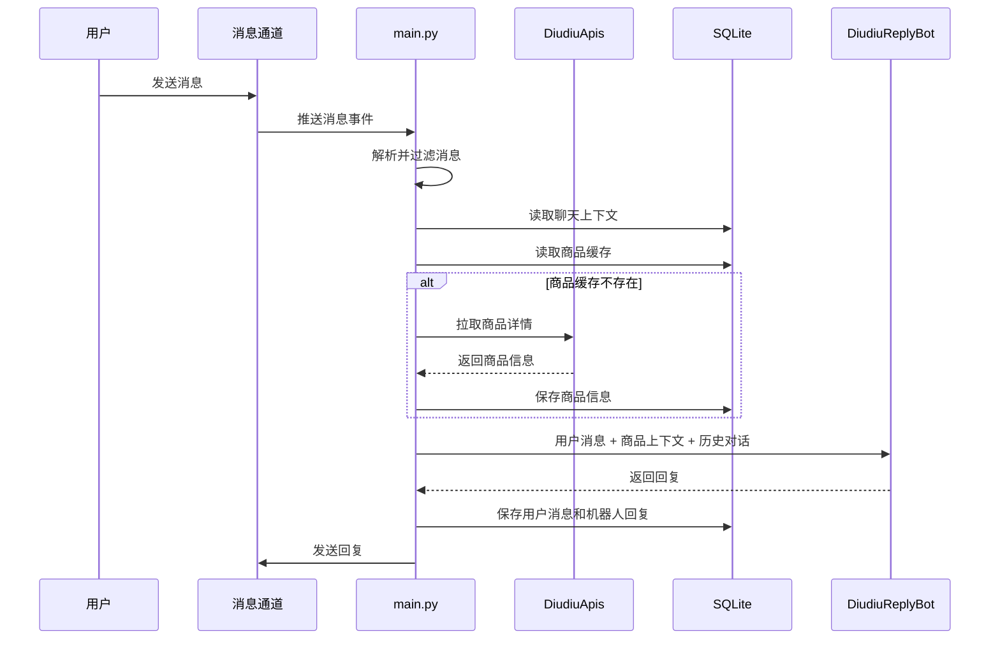

# 架构说明

## 整体概览

当前实现虽然代码量不大，但逻辑上已经具备一个智能客服原型的基本分层：

1. 消息通道接入
2. 消息解析与过滤
3. 上下文和商品信息读取
4. 意图识别与回复生成
5. 回复发送
6. 持久化与运行控制

## 模块拆解

### `main.py`

主要职责：

- 加载环境变量
- 建立和维护 WebSocket 长连接
- 发送心跳
- 刷新 token
- 接收并解析消息
- 过滤系统消息和过期消息
- 处理人工接管逻辑
- 拉取商品信息
- 组装上下文并调用回复机器人
- 将回复发送回消息通道

### `DiudiuAgent.py`

主要职责：

- 初始化 OpenAI 兼容模型客户端
- 加载 Prompt
- 执行意图路由
- 调用不同 Agent 生成回复
- 执行基础安全过滤

内部包含几个子 Agent：

- `ClassifyAgent`
- `PriceAgent`
- `TechAgent`
- `DefaultAgent`

### `DiudiuApis.py`

主要职责：

- 管理 Session 和 Cookie
- 检查登录状态
- 获取 token
- 获取商品详情
- 在 Cookie 变化后同步更新本地配置

### `context_manager.py`

主要职责：

- 初始化 SQLite 表结构
- 保存按 `chat_id` 组织的消息历史
- 保存商品信息缓存
- 维护议价轮次
- 按会话读取上下文

### `utils/diudiu_utils.py`

主要职责：

- 解析 Cookie 字符串
- 生成请求签名和各种 ID
- 解码消息内容

## 运行流程

## 当前设计的优点

- 通道接入、决策逻辑、持久化已经有基本边界
- Prompt 外置，便于后续持续调优
- 人工接管虽然简单，但非常实用
- 用 SQLite 做本地原型，轻量且便于演示

## 当前设计的不足

- `main.py` 承担了过多编排逻辑
- 安全策略目前主要还是关键词过滤
- 没有显式置信度机制
- 评测还停留在设计层，没有完整落地
- 通道抽象还不够清晰

## 后续更合理的演进方向

如果继续迭代，这个项目比较顺的演进路径会是：

1. 抽出通道适配接口
2. 抽出策略层，统一管理回复、无需回复、转人工规则
3. 增加结构化评测目录
4. 增加质检队列和简单后台

这样既能保留现在的代码基础，也能让它更像一个真正可扩展的 AI 客服平台原型。
